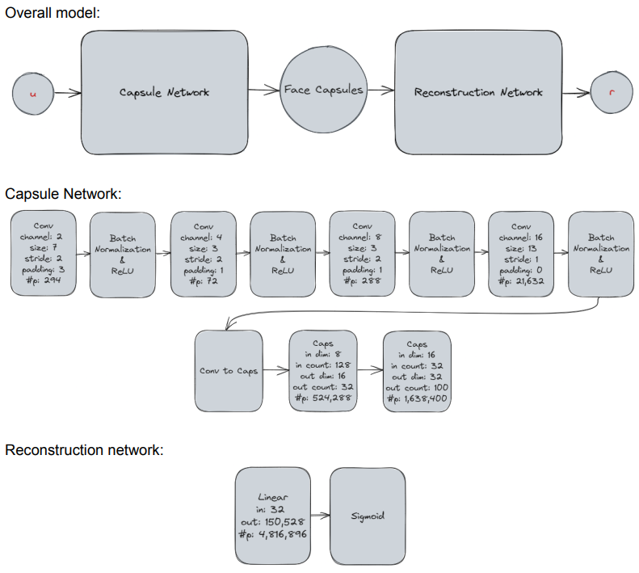
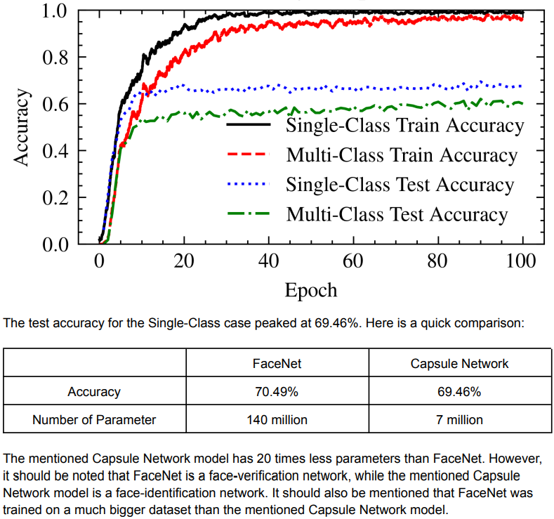

A face identification implementation of [capsule networks](https://arxiv.org/pdf/1710.09829.pdf). I used [this dataset](https://www.kaggle.com/datasets/nhatdealin/casiawebface-dataset-crop), and forked from [this repository](https://github.com/kaanbuyukdemirci/capsule_network). 

You need to download the data at "datasets/casia_web_face_crop_dataset/"

Here is the overall model:

Here are the results:

There is no documentation for this code, but you can visit [the forked repository](https://github.com/kaanbuyukdemirci/capsule_network) to see the documentation.

This work isn't really complete and will not be completed. I didn't really tested many different architectures, and I trained the same model only once. I also didn't implemented any of the recent loss functions, and that is why I compared it with a relatively old model.

